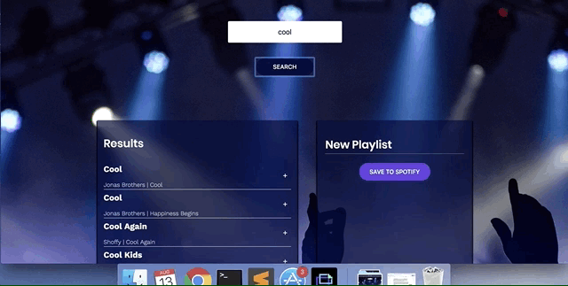
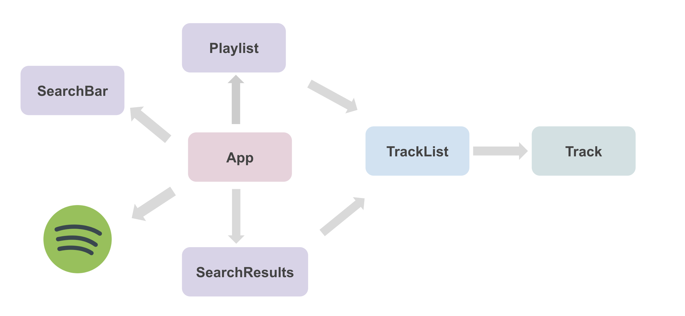

#MusicBinge

This project was bootstrapped with [Create React App](https://github.com/facebook/create-react-app).

MusicBinge is a fully-functional React App to create custom playlists with interactive search functionality, integrating Spotify REST API.

Demo:

Components Overview:

- App: Main component to render child components.
- Playlist: Updates names of custom Playlists.
- SearchBar: Searches songs.
- SearchResults: Reflects search results of input.
- Spotify: Integrates Spotify API to log in, search, and save custom Playlists.
- TrackList: Allows each song in search results to be added and saved in Playlists.
- Track: Adds or Removes tracks from Playlists.

